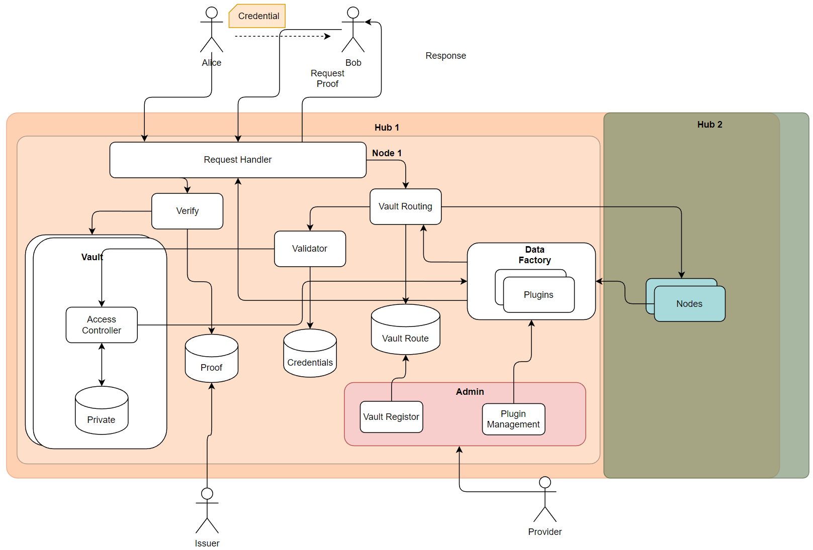

# Architecture

# 用户 
用户可以是一个自然人，也可以是一组人的集合，例如一个公司。用DID表示一个用户，对应DID Document的Controller属性中存储谁对DID有控制权限，具体的实现方法是在DID Document的Verification Method保存用户的公钥，用户保存私钥，通过公私钥签名算法实现。

# Vault
Vault中存储用户的数据，Vault的元数据（Metadata）以一个DID Document的格式存储。DID为该Vault的DID，Controller和Verification Method实现该Vault的访问控制逻辑。

一个Vault中可以存储多个数据项，每个数据项称为一个Entry。Entry以Key-Value对的形式保存，其Key是根据Value和一个随机数生成的哈希值，它具有唯一性、切不可预测，其Valut可以为任何形式的数据，其内容通常是加密的，对于不敏感的数据也可以以明文保存。
## Vault access
要访问一个Vault内的数据，必须通过Vault的访问控制逻辑。

### 写与删除数据
仅有Vault的Controller才有向Vault中写入或者删除数据的权限。
### 读数据
Vault的Controller可以向其他用户共享数据，共享时Vault的Controller须向被共享的人提供Entry ID以及访问证明。

